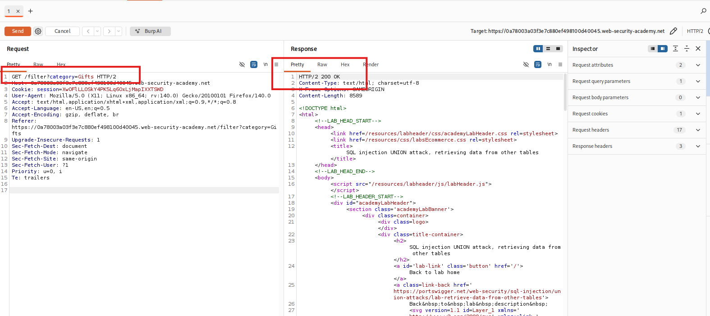
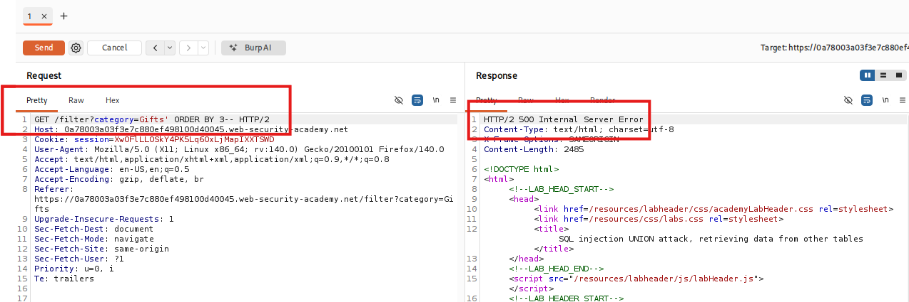
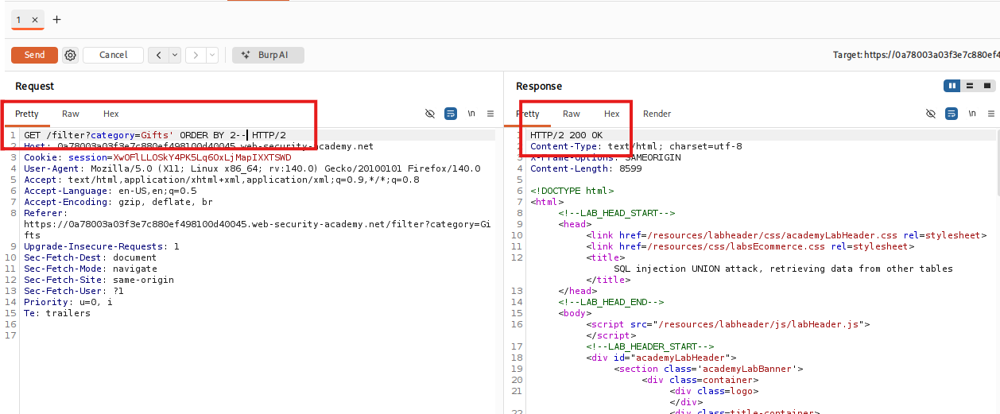
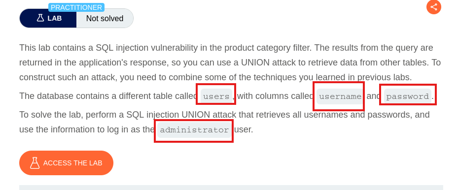
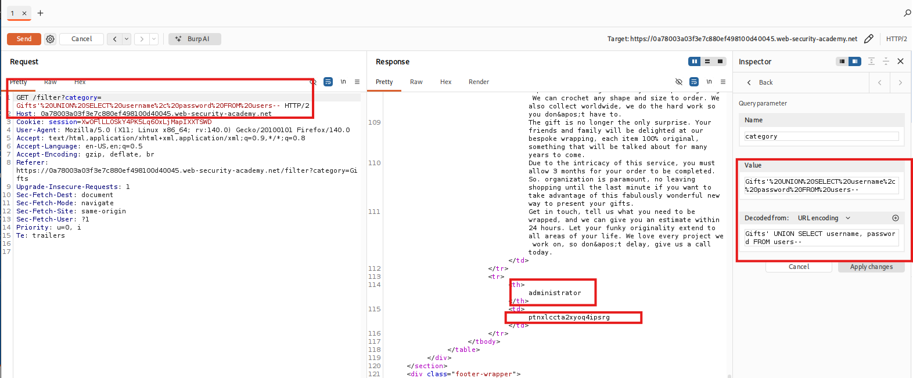
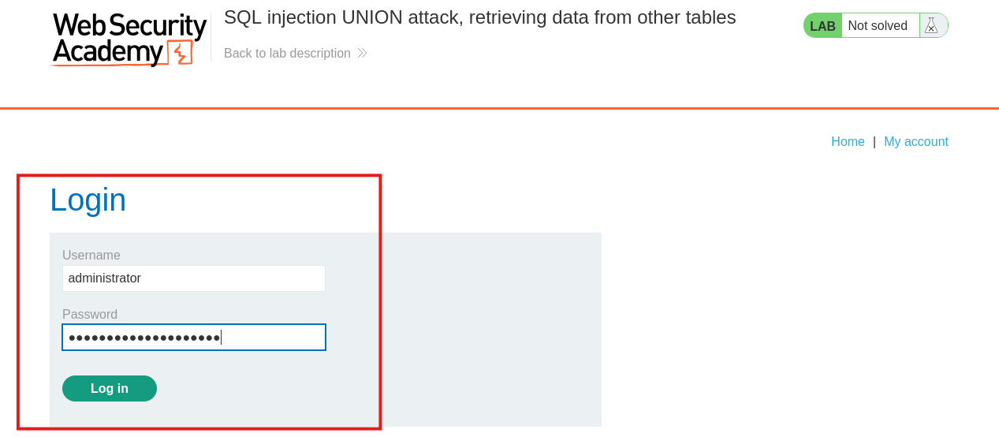
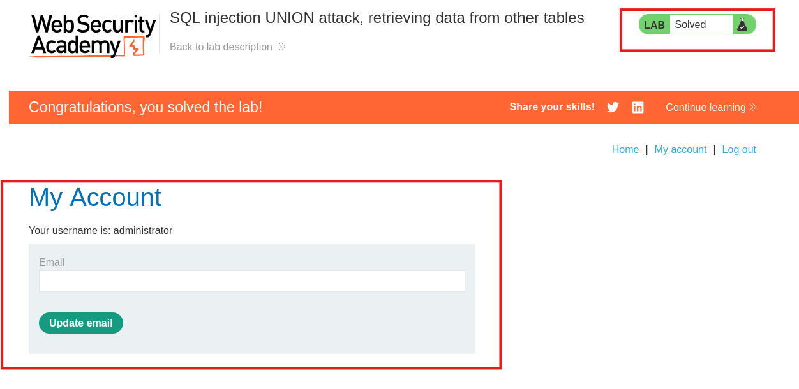

# SQL injection UNION attack, retrieving data from other tables

## I. Descripción de la vulnerabilidad o ataque
Este laboratorio expone una vulnerabilidad de inyección SQL en el filtro de categoría de productos, permitiendo al atacante ejecutar un ataque de tipo `UNION` avanzado. Una vez superado el paso previo de determinar el número exacto de columnas y sus tipos de datos, el objetivo principal cambia radicalmente hacia la exfiltración: extraer información sensible contenida en otras tablas de la base de datos.

Al formular un payload estructurado mediante la sentencia `UNION SELECT`, el atacante puede desviar el flujo legítimo de la aplicación para que devuelva registros ajenos al contexto original del negocio. En este escenario práctico, el objetivo es forzar a la base de datos a recuperar las credenciales de la tabla de usuarios administradores, concatenando los campos deseados dentro de las columnas visibles para volcar nombres de usuario y contraseñas directamente en la respuesta HTTP visible de la página web.

## II. Tabla de Códigos de Referencia (NIST, MITRE, CWE, SANS)
| Marco de Referencia | Código / Identificador | Descripción |
| :--- | :--- | :--- |
| **CWE** | CWE-89 | Improper Neutralization of Special Elements used in an SQL Command ('SQL Injection') |
| **MITRE ATT&CK** | T1190 | Exploit Public-Facing Application (Initial Access) |
| **NIST SP 800-53** | SI-10 | Information Input Validation |
| **OWASP Top 10** | A03:2021-Injection | Categoría principal de vulnerabilidades de inyección, específicamente enfocada en la extracción indebida de datos de tablas cruzadas. |
| **SANS IR** | Identificación / Detección | Fase del SANS Incident Handlers Handbook orientada al análisis de logs web erróneos (errores 500) y payloads inyectados con queries reflectivas orientadas a la exfiltración de tablas de sistema. |

## III. Detección y Explotación Paso a Paso

### Paso 1: Interceptación del tráfico del filtro
1. Abre el navegador integrado de Burp Suite y accede a la página de inicio del laboratorio.
2. Haz clic en una de las categorías de productos disponibles en la interfaz web (por ejemplo, `Lifestyle` o `Tools`).
3. Ve a **Proxy > HTTP history**, localiza la solicitud correspondiente (`GET /filter?category=...`) y envíala al módulo **Repeater** usando el atajo `Ctrl + R`.
4. Muévete a la pestaña del Repeater para iniciar las pruebas de inyección sobre el parámetro de la categoría.

> **Petición inicial aislada dentro de Burp Repeater**
> 

### Paso 2: Ejecución del método ORDER BY para determinar columnas
La forma más eficiente de auditar el número de columnas es utilizar la cláusula `ORDER BY`. Esta instrucción le indica a la base de datos por cuál columna ordenar los resultados utilizando su índice numérico (1, 2, 3, etc.). Si solicitamos ordenar por una columna que no existe, la base de datos fallará.

1. Al final del parámetro de la categoría, inyecta una comilla simple para romper el string legítimo y añade la instrucción para evaluar la primera columna, cerrando con comentarios estándar (`--`):
   ```text
   ' ORDER BY 1--
   ```
2. Envía la petición y observa que el servidor web responde con un código 200 OK. Esto confirma que existe al menos una columna.
3. Modifica el número secuencialmente e incrementa el payload:
   ```text
   ' ORDER BY 2--
   ```
4. Seguimos incrmentando el valor numerico ( `' ORDER BY 3--`, `' ORDER BY 4--`)
Si la consulta acepta el número 3 de forma exitosa pero genera un error HTTP 500 al enviar el número 4, significa que la consulta original devuelve exactamente 3 columnas.

> **Respuesta Incorrecta**
> 

> **Respuesta Correcta**
> 

* **Por lo tanto la aplicacion web posee como maximo 2 columnas*

### Paso 3: Utilización de parametros
1. Al iniciar cada laboratorio de BurpSuite, se nos da un contexto, en este laboratorio, nos explican que en la DB poseen una tabla llamada `users` que contien 2 columnas, la primera llamada `username` y la segunda llamada `password`
  >

2. tomamos estos nombre de columnas, y buscamos el `username` y `password` de el `administrador`
  >

3. Luego al obtener estas credenciales nos dirigimos al inicio de sesion de usuario, y rellenamos los campos segun corresponda
  >

4. Y completamos con exito el laboratorio
  >

## IV. Mitigación
## IV. Mitigación

1. **Implementación estricta de Consultas Parametrizadas (Prepared Statements):** Desvincular completamente la lógica del query SQL de los datos proporcionados por el usuario en el backend. Al parametrizar sentencias como `SELECT * FROM products WHERE category = ?`, el motor de base de datos compila la consulta de manera fija, tratando cualquier payload malicioso de tipo `UNION SELECT` como una cadena de texto literal inofensiva en lugar de código ejecutable.

2. **Principio de Menor Privilegio en la Cuenta de Conexión:** Restringir los permisos del usuario de la base de datos utilizado por la aplicación web. Al limitar los privilegios para que el backend solo acceda a las tablas estrictamente necesarias de su propio esquema (ej. `products`), se impide de forma nativa que un ataque exitoso de inyección SQL pueda realizar lecturas o consultas cruzadas hacia tablas críticas localizadas en otros esquemas o bases de datos (como tablas de credenciales).

3. **Defensa en Capas mediante Validación de Datos y Listas Blancas (Whitelisting):** Validar minuciosamente la entrada del parámetro `category` antes de que interactúe con la capa de persistencia. Configurar el sistema para aceptar únicamente un conjunto de caracteres predefinido o identificadores esperados; si el valor recibido no coincide con la estructura lógica preestablecida o contiene palabras clave reservadas de bases de datos, la petición debe rechazarse de inmediato en el controlador web.

## ⚠️ Aviso de Responsabilidad y Ética (Disclaimer)

> [!CAUTION]
> **ADVERTENCIA DE SEGURIDAD:** El contenido de este repositorio tiene fines **estrictamente educativos y de investigación**. El uso de estas técnicas sin autorización es ilegal.

Como profesional en formación en el área de la ciberseguridad, es mi responsabilidad subrayar los siguientes puntos:

* **Entornos Controlados:** Todas las pruebas de concepto (PoC) documentadas aquí se han realizado en laboratorios autorizados (**PortSwigger Academy**) y entornos locales diseñados específicamente para este fin.
* **Autorización Explícita:** Nunca se debe ejecutar ninguna técnica de inyección o escaneo sobre sistemas, redes o aplicaciones sin la **autorización previa, explícita y por escrito** de los propietarios de dichos activos.
* **Marco Legal:** El uso no autorizado de estas técnicas en sistemas reales constituye un delito informático bajo las leyes internacionales y locales. El acceso no autorizado a sistemas de procesamiento de datos es punible por ley.

---

> [!IMPORTANT]
> *"La seguridad es un proceso de construcción, no de destrucción. Mi objetivo es identificar vulnerabilidades para fortalecer las defensas y proteger la integridad de los datos de los usuarios."*

---
