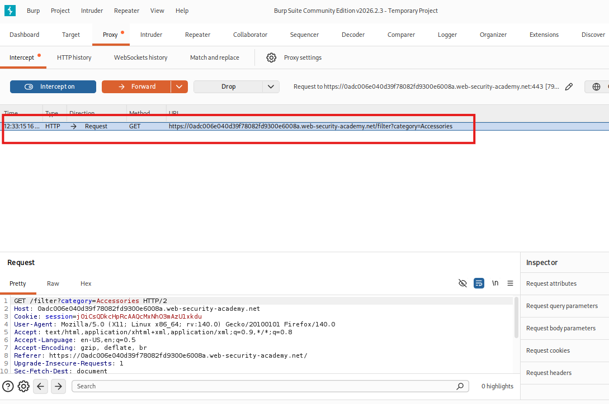
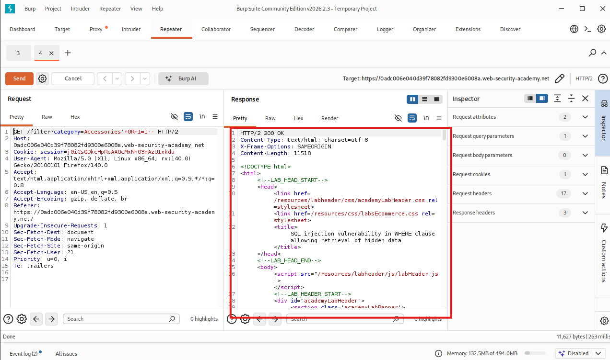
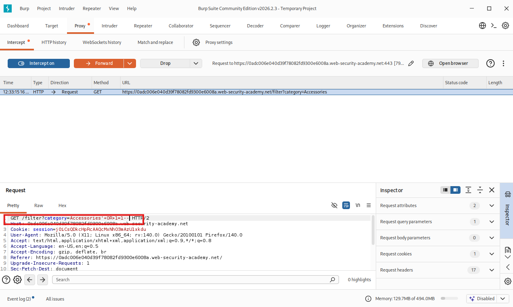
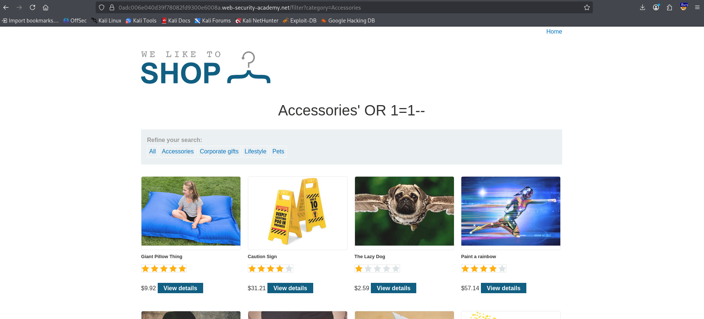

# PortSwigger-Labs
## SQL Injection: Vulnerabilidad en cláusula WHERE
### Descripción
Este laboratorio contiene una vulnerabilidad de inyección SQL en el filtro de categoría de producto. La aplicación realiza una consulta SQL que filtra los productos por categoría y por su estado de publicación (lanzado = 1).

### Objetivo
Realizar un ataque SQLi para recuperar productos no publicados (donde lanzado = 0).

### Metodología
* Identificación: Se observó que el parámetro category en la URL se utiliza directamente en la consulta a la base de datos.
* Explotación: Se utilizó una condición lógica siempre verdadera (OR 1=1) y caracteres de comentario (--) para anular el resto de la consulta original.

### Payload utilizado:
```bash
'+OR+1=1--
```

### Resultado
Al inyectar el payload, la consulta resultante ignora el filtro de seguridad:
SELECT * FROM productos WHERE categoria = 'Gifts' OR 1=1--' AND lanzado = 1
Esto permitió visualizar la totalidad del inventario, resolviendo exitosamente el laboratorio.

# Laboratorio: SQL Injection en Cláusula WHERE (Recuperación de Datos Ocultos)
* **Plataforma**: PortSwigger Academy
* **Dificultad**: Aprendiz
* **Objetivo**: Evadir el filtro de visibilidad de productos para acceder a inventario no publicado.

##  1. Marco de Referencia
| Marco | Id | Categoria / Nombre |
|-------|----|--------------------|
| MITRE ARR&CK | T1190 | Exploit Public-Facing Application |
| CWE | CWE-99 | Improver Neutralization of Special Elements used in an SQL Command |
| NIST SP 800-53 | SI-10 | Información Input Validation |

## 2. Metodología de Pruebas (PTES Modificado)
1. **Análisis de Reconocimiento:** Identificación de parámetros en la URL (`?category=`) que interactúan con la base de datos.
2. **Análisis de Vulnerabilidades:** Prueba de caracteres especiales (`'`) para provocar errores o cambios en la respuesta del servidor.
3. **Explotación:** Inyección de lógica booleana para manipular el resultado de la consulta SQL.
4. **Post-Explotación:** Verificación de acceso a datos que antes estaban ocultos (`released = 0`).

## 3. Desarrollo de Payload
**Payload Final**: `'+OR+1=1--`
* **`'`(Comilla simple)**: Rompe la cadena de Texto original en la consulta SQL.
* `OR 1=1`: Inyecta una condicion que simepre se evalua como verdadera.
* **`--`(Doble guion)**: Indica a la base de datos que ignore el resto de la consulta original (el comentario).

**Transformación de la Query**:
* **Original**: `SELECT * FROM productos WHERE categoria = 'Gifts' AND Gifts = 1`
* **Inyectada**: `SELECT * FROM productos WHERE categoria = 'Gifts'+OR+1=1-- AND Gifts = 1`

## 4. Evidencia y Paso a Paso

**Paso A: Intercepción del Trafico**
"Utilicé **Burp Suite Professional/Community** para capturar la peticion GET cuando se selecciona un filtro de categoría."



**Paso B: Modificación del Parámetro**
"Envie la petición al Repeater para realizar pruebas controladas. Modifiqué el valor de `category` añadiendo el payload , pero primero en la pestaña 'Repeater' para ver el estado de la respuesta."


**Paso C: Mandar efectivamente la peticion**
"Al revisar en la pestaña 'Repeater' que el codigo de estado de repuesta equivale a 200, significa que es una entrada exitosa por lo que se modifica en el 'Capturador de paquetes' -> Proxy, y se manda finaalmente la peticion.


**Paso D: Confirmación de Resultados*
"La aplicación ahora renderiza productos que no tienen el flag de 'Accessories'. El laboratorio se marca como resuelto."
* **Inyección aplicada**


* **Peticion no alterada**


## 5. Recomendaciones de Mitigación (Remadiación)
Esvital cerrar el reporte con la solución técnica:
* **Uso de Consultas Preparadas (Parametrized Queries)**: Evita la concatenacion directa de entradas de usuario en string SQL.
* **Principio de Meno Privilegio**: Asegurar que el usaurio de la DB no tenga permisos excesivos.

  
