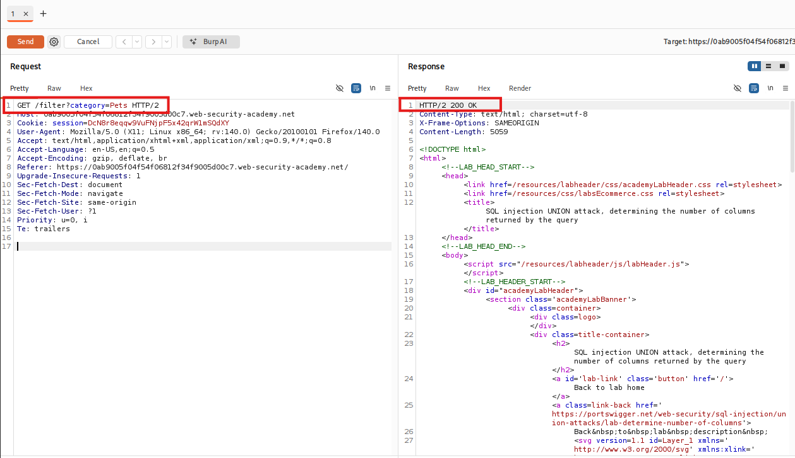

# SQL injection UNION attack, determining the number of columns returned by the query

## I. Descripción de la vulnerabilidad o ataque
Este laboratorio contiene una vulnerabilidad de inyección SQL en el filtro de categoría de productos. Para poder ejecutar con éxito un ataque de tipo `UNION`, el atacante debe cumplir obligatoriamente con el primer requisito técnico de esta técnica: **determinar el número exacto de columnas que devuelve la consulta original**. 

Si el payload inyectado intenta unir un número de columnas diferente, el motor de la base de datos romperá la ejecución y el backend de la aplicación web devolverá un error HTTP general. El objetivo en este escenario es utilizar técnicas de enumeración controlada mediante la cláusula `ORDER BY` o sentencias `UNION SELECT` con valores `NULL` para mapear la estructura del query legítimo y dejar el entorno listo para una posterior exfiltración de datos.

---

## II. Tabla de Códigos de Referencia (NIST, MITRE, CWE, SANS)

| Marco de Referencia | Código / Identificador | Descripción |
| :--- | :--- | :--- |
| **CWE** | CWE-89 | Improper Neutralization of Special Elements used in an SQL Command ('SQL Injection') |
| **MITRE ATT&CK** | T1190 | Exploit Public-Facing Application (Initial Access) |
| **NIST SP 800-53** | SI-10 | Information Input Validation |
| **OWASP Top 10** | A03:2021-Injection | Categoría principal de vulnerabilidades de inyección |
| **SANS IR** | Identificación / Detección | Fase del SANS Incident Handlers Handbook orientada al análisis de telemetría de red y logs web para detectar anomalías provocadas por escaneos iterativos de bases de datos. |

---

## III. Detección y Explotación Paso a Paso

### Paso 1: Interceptación del tráfico del filtro
1. Abre el navegador integrado de Burp Suite y accede a la página de inicio del laboratorio.
2. Haz clic en una de las categorías de productos disponibles en la interfaz web (por ejemplo, `Lifestyle` o `Tools`).
3. Ve a **Proxy > HTTP history**, localiza la solicitud correspondiente (`GET /filter?category=...`) y envíala al módulo **Repeater** usando el atajo `Ctrl + R`.
4. Muévete a la pestaña del Repeater para iniciar las pruebas de inyección sobre el parámetro de la categoría.

> **Petición inicial aislada dentro de Burp Repeater**
> 

---

### Paso 2: Ejecución del método ORDER BY para determinar columnas
La forma más eficiente de auditar el número de columnas es utilizar la cláusula `ORDER BY`. Esta instrucción le indica a la base de datos por cuál columna ordenar los resultados utilizando su índice numérico (1, 2, 3, etc.). Si solicitamos ordenar por una columna que no existe, la base de datos fallará.

1. Al final del parámetro de la categoría, inyecta una comilla simple para romper el string legítimo y añade la instrucción para evaluar la primera columna, cerrando con comentarios estándar (`--` seguido de un espacio, o `%23` si usas la almohadilla URL-encoded):
   ```text
   ' ORDER BY 1--
