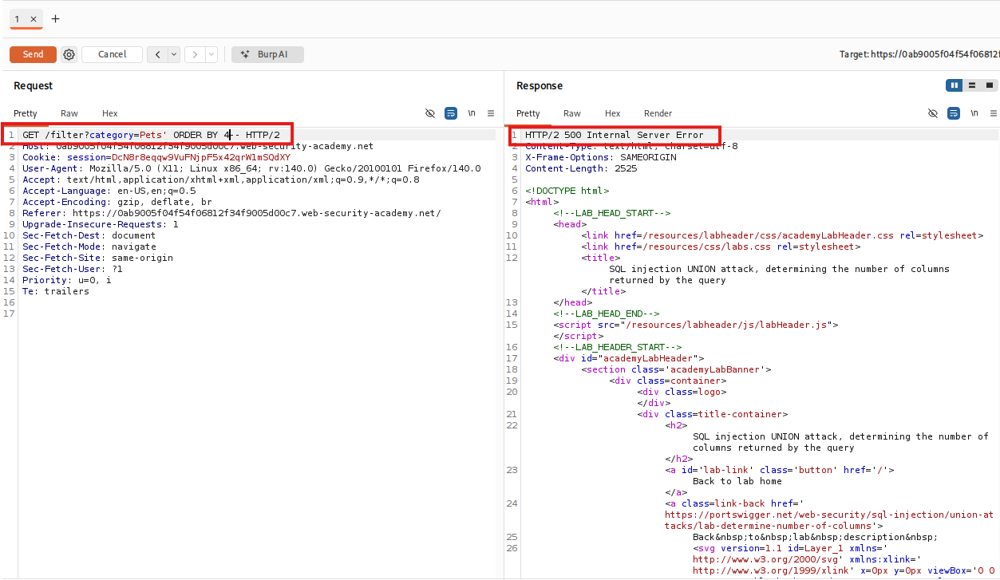
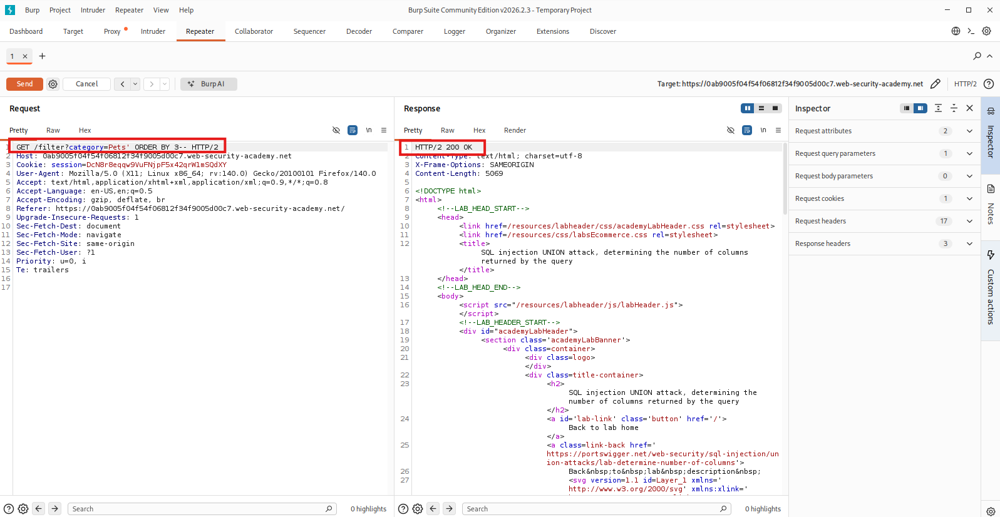
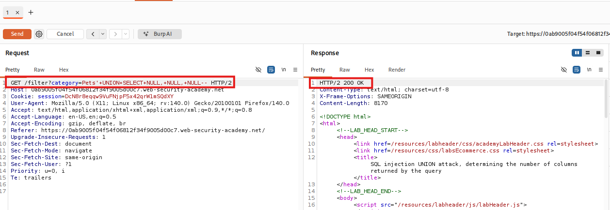
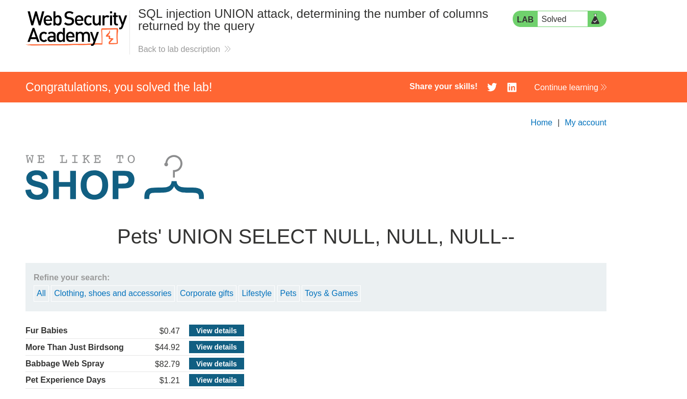

# SQL injection UNION attack, determining the number of columns returned by the query

## I. Descripción de la vulnerabilidad o ataque
Este laboratorio contiene una vulnerabilidad de inyección SQL en el filtro de categoría de productos. Para poder ejecutar con éxito un ataque de tipo `UNION`, el atacante debe cumplir obligatoriamente con el primer requisito técnico de esta técnica: **determinar el número exacto de columnas que devuelve la consulta original**. 

Si el payload inyectado intenta unir un número de columnas diferente, el motor de la base de datos romperá la ejecución y el backend de la aplicación web devolverá un error HTTP general. El objetivo en este escenario es utilizar técnicas de enumeración controlada mediante la cláusula `ORDER BY` o sentencias `UNION SELECT` con valores `NULL` para mapear la estructura del query legítimo y dejar el entorno listo para una posterior exfiltración de datos.

---

## II. Tabla de Códigos de Referencia (NIST, MITRE, CWE, SANS)

| Marco de Referencia | Código / Identificador | Descripción |
| :--- | :--- | :--- |
| **CWE** | CWE-89 | Improper Neutralization of Special Elements used in an SQL Command ('SQL Injection') |
| **MITRE ATT&CK** | T1190 | Exploit Public-Facing Application (Initial Access) |
| **NIST SP 800-53** | SI-10 | Information Input Validation |
| **OWASP Top 10** | A03:2021-Injection | Categoría principal de vulnerabilidades de inyección |
| **SANS IR** | Identificación / Detección | Fase del SANS Incident Handlers Handbook orientada al análisis de telemetría de red y logs web para detectar anomalías provocadas por escaneos iterativos de bases de datos. |

---

## III. Detección y Explotación Paso a Paso

### Paso 1: Interceptación del tráfico del filtro
1. Abre el navegador integrado de Burp Suite y accede a la página de inicio del laboratorio.
2. Haz clic en una de las categorías de productos disponibles en la interfaz web (por ejemplo, `Lifestyle` o `Tools`).
3. Ve a **Proxy > HTTP history**, localiza la solicitud correspondiente (`GET /filter?category=...`) y envíala al módulo **Repeater** usando el atajo `Ctrl + R`.
4. Muévete a la pestaña del Repeater para iniciar las pruebas de inyección sobre el parámetro de la categoría.

> **Petición inicial aislada dentro de Burp Repeater**
> 

---

### Paso 2: Ejecución del método ORDER BY para determinar columnas
La forma más eficiente de auditar el número de columnas es utilizar la cláusula `ORDER BY`. Esta instrucción le indica a la base de datos por cuál columna ordenar los resultados utilizando su índice numérico (1, 2, 3, etc.). Si solicitamos ordenar por una columna que no existe, la base de datos fallará.

1. Al final del parámetro de la categoría, inyecta una comilla simple para romper el string legítimo y añade la instrucción para evaluar la primera columna, cerrando con comentarios estándar (`--`):
   ```text
   ' ORDER BY 1--
   ```
2. Envía la petición y observa que el servidor web responde con un código 200 OK. Esto confirma que existe al menos una columna.
3. Modifica el número secuencialmente e incrementa el payload:
   ```text
   ' ORDER BY 2--
   ```
4. Seguimos incrmentando el valor numerico ( `' ORDER BY 3--`, `' ORDER BY 4--`)
Si la consulta acepta el número 3 de forma exitosa pero genera un error HTTP 500 al enviar el número 4, significa que la consulta original devuelve exactamente 3 columnas.

> **Respuesta Incorrecta**
> 

> **Respuesta Correcta**
> 

* **Por lo tanto la aplicacion web posee como maximo 3 columnas**

### Paso 3: Método Alternativo / Confirmación usando UNION SELECT NULL
Una segunda metodología igual de válida (y útil si el backend bloquea la cláusula `ORDER BY`) consiste en inyectar directamente sentencias `UNION SELECT` utilizando el valor `NULL`. El valor `NULL` es ideal porque es compatible con prácticamente cualquier tipo de datos en todas las bases de datos del mercado.

1. Reemplaza el parámetro inyectado en Burp Suite por una estructura que contenga valores nulos. Debes ir agregando un `NULL` por cada intento hasta que la petición deje de dar error:

   * Intento 1: `'+UNION+SELECT+NULL--` (Devuelve Error 500)

   * Intento 2: `'+UNION+SELECT+NULL,+NULL--` (Devuelve Error 500)

   * Intento 3: `'+UNION+SELECT+NULL,+NULL,+NULL--` (Devuelve código 200 OK)

Cuando la cantidad de NULL coincide con el query original del backend, la página renderiza correctamente y se confirma de forma absoluta la cantidad de columnas identificadas en el Paso 2.

> **Null estructura coincidente**
> 

### Paso 4: Verificación y Resolución del Laboratorio
1. Copia el payload que causó la respuesta exitosa en el Repeater (ya sea el `ORDER BY` límite o la estructura completa de `UNION SELECT NULL, NULL, NULL`).
2. Pégalo directamente en la barra de direcciones de tu navegador web principal dentro de la URL del filtro.
3. Presiona Enter. Al procesarse la inyección en la consulta del servidor web, el laboratorio detectará que has determinado la cantidad de columnas de manera precisa y el banner superior cambiará a verde indicando que el desafío ha sido solucionado.

> **Lab Solucionado**
> 

IV. Mitigación
1. **Implementación de Consultas Parametrizadas (Prepared Statements):** Forzar el uso de consultas preparadas en el desarrollo del backend. Al usar parámetros del tipo `SELECT * FROM products WHERE category = ?`, el motor de la base de datos tratará cualquier entrada del usuario estrictamente como datos literales, haciendo que comandos como `UNION` u `ORDER BY` se vuelvan completamente inofensivos.

2. **Sanitización y Validación del Parámetro de Entrada:** Implementar controles basados en listas blancas (whitelisting) para el parámetro `category`. Si las categorías son estáticas (por ejemplo: Gifts, Food, Clothes), el backend debe rechazar automáticamente cualquier petición que contenga caracteres de control ajenos a esa lista definida.

3. **Minimización de Detalles en Errores de Aplicación:** Configurar el servidor para manejar excepciones de forma genérica. El ocultar los mensajes de error internos o comportamientos específicos (como pasar de un 200 a un 500 de forma tan evidente) dificulta enormemente la fase de reconocimiento y enumeración a ciegas por parte de un atacante.


---

## ⚠️ Aviso de Responsabilidad y Ética (Disclaimer)

> [!CAUTION]
> **ADVERTENCIA DE SEGURIDAD:** El contenido de este repositorio tiene fines **estrictamente educativos y de investigación**. El uso de estas técnicas sin autorización es ilegal.

Como profesional en formación en el área de la ciberseguridad, es mi responsabilidad subrayar los siguientes puntos:

* **Entornos Controlados:** Todas las pruebas de concepto (PoC) documentadas aquí se han realizado en laboratorios autorizados (**PortSwigger Academy**) y entornos locales diseñados específicamente para este fin.
* **Autorización Explícita:** Nunca se debe ejecutar ninguna técnica de inyección o escaneo sobre sistemas, redes o aplicaciones sin la **autorización previa, explícita y por escrito** de los propietarios de dichos activos.
* **Marco Legal:** El uso no autorizado de estas técnicas en sistemas reales constituye un delito informático bajo las leyes internacionales y locales. El acceso no autorizado a sistemas de procesamiento de datos es punible por ley.

---

> [!IMPORTANT]
> *"La seguridad es un proceso de construcción, no de destrucción. Mi objetivo es identificar vulnerabilidades para fortalecer las defensas y proteger la integridad de los datos de los usuarios."*

---
