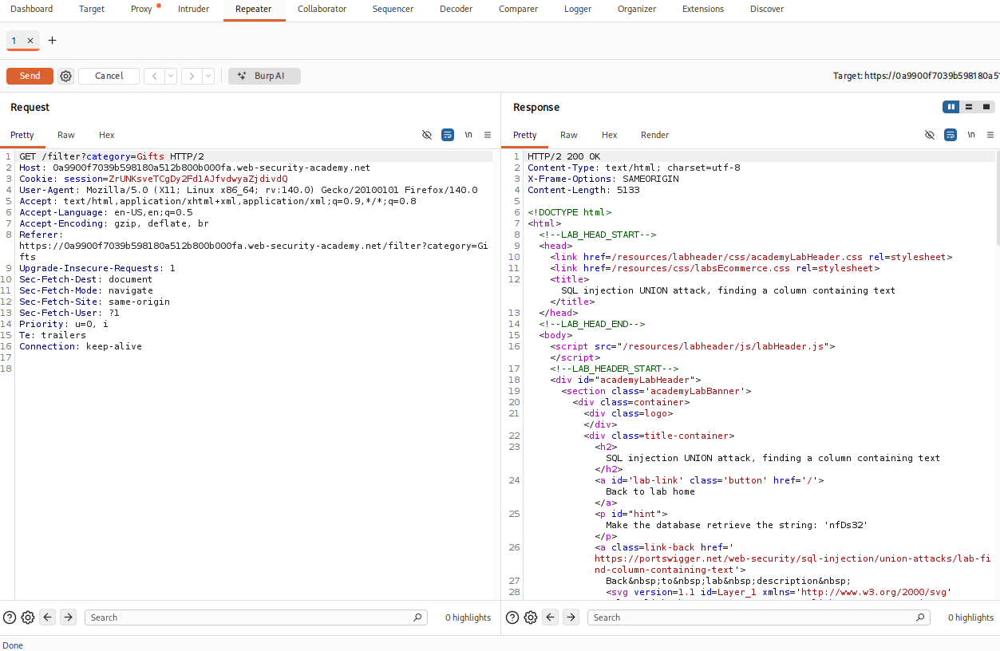
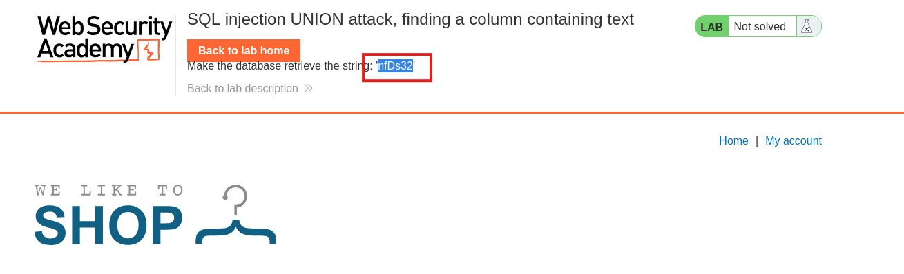
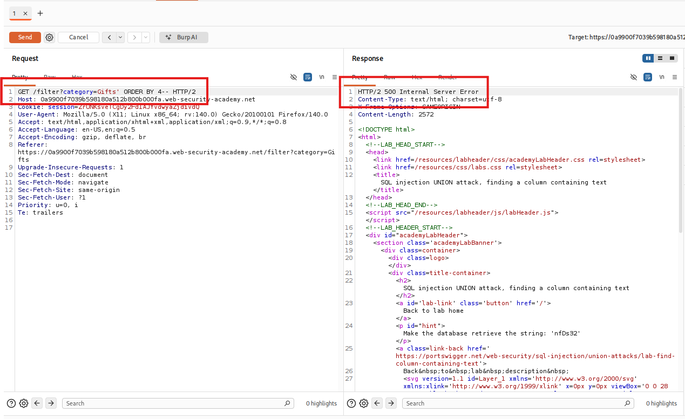
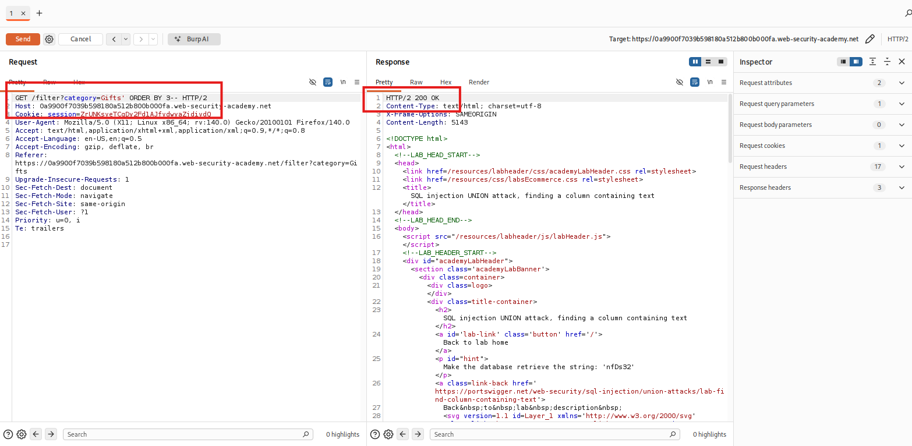
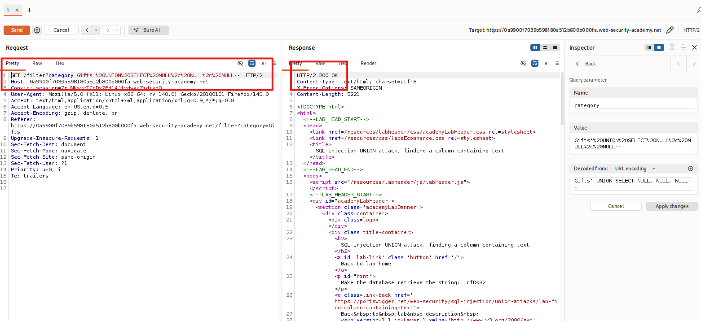
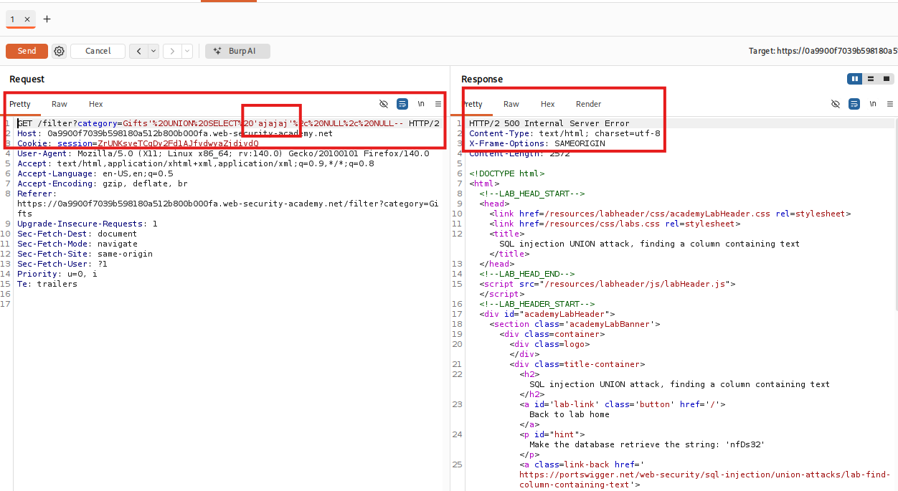
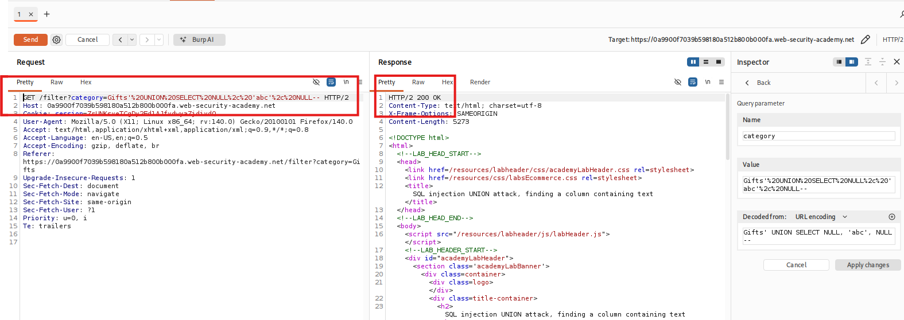
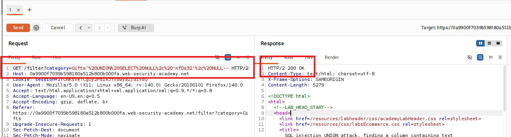
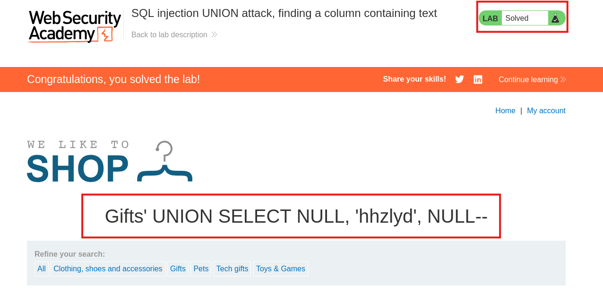

# SQL injection UNION attack, finding a column containing text

## I. Descripción de vulnerabilidad o ataque
En este laboratorio, nos enfocaremos en el Ataque basado en UNION. Este método aprovecha el operador UNION de SQL, cuyo propósito es combinar los resultados de dos o más sentencias SELECT en un solo conjunto de resultados.

Para explotar con éxito esta vulnerabilidad y extraer información confidencial de la base de datos (como tablas de usuarios o contraseñas), un atacante no puede simplemente lanzar una consulta arbitraria; debe cumplir estrictamente con las reglas del motor de base de datos. El ataque se divide en dos fases críticas de reconocimiento:

1. Determinar el número de columnas: La consulta inyectada mediante UNION debe devolver exactamente la misma cantidad de columnas que la consulta original. De lo contrario, el sistema generará un error de sintaxis y bloqueará la ejecución.

2. Identificar columnas compatibles con texto: El operador UNION exige que los tipos de datos en las columnas correspondientes sean compatibles. Dado que la información que se desea exfiltrar generalmente consta de cadenas de caracteres (strings), el objetivo de este ejercicio es probar sistemáticamente cada columna utilizando valores NULL y caracteres de prueba. Esto permite descubrir qué posición dentro del flujo de datos es capaz de procesar, renderizar y mostrar texto en la interfaz web.

## II. Tabla de Códigos de Referencia (NIST, MITRE, CWE, SANS)
| Marco de Referencia | Codigo/Identificador | Descripción |
|---------------------|----------------------|-------------|
| CWE | CWE-89 | Improper Neutralization of Special Elements used in an SQL Command ('SQL Injection') |
| MITRE ATT&CK | T1190 | Exploit Public-Facing Application (Initial Access) |
| NIST SP 800-53 | SI-10 | Information Input Validation |
| | SI-11 | Error Handling |
| | SA-11 | Developer Testing and Evaluation |
| | AC-4 | Information Flow Enforcement |
| OWASP Top 10 | A03:2021-Injection | Categoria principal de ataques de Inyección |
| SANS IR | Identificacion | Fase del SANS Incident Handlers Handbook orientada al análisis de telemetría de red y logs web para detectar anomalías provocadas por el testeo iterativo de columnas orientadas a la exfiltración. |

## III. Detección y Explotación Paso a Paso
### Paso 1: Interceptación del tráfico del filtro
1. Abre el navegador integrado de Burp Suite y accede a la página de inicio del laboratorio.
2. Haz clic en una de las categorías de productos disponibles en la interfaz web (por ejemplo, Lifestyle o Tools).
3. Ve a Proxy > HTTP history, localiza la solicitud correspondiente (GET /filter?category=...) y envíala al módulo Repeater usando el atajo Ctrl + R.
4. Muévete a la pestaña del Repeater para iniciar las pruebas de inyección sobre el parámetro de la categoría.
> **Vista del paaquete capturado en el Repeate de BurpSuite**
> 

### Paso 2: Identificacion de la cadena de Texto
Dentro de este laboratorio, y para lograr resolverlo, nos entrengan una cadena de texto en el principio, si uno se dirije a la pagina web del laboratorio bajo la barrade navegacion acotecera un mensaje que dice lo siguiente:
**"hhzlyd" --> dependera exclusivamente del laboratorio la aleatoriedad de la cadena de texto.**
Esta cadena de texto nos permitira (una vez que poseamos en que columna se podria ubicar), resover el laboratorio.
> **Vista para el caso practico de este laboratorio**
> 

### Paso 3: Ejecución del método ORDER BY para determinar columnas
La forma más eficiente de auditar el número de columnas es utilizar la cláusula `ORDER BY`. Esta instrucción le indica a la base de datos por cuál columna ordenar los resultados utilizando su índice numérico (1, 2, 3, etc.). Si solicitamos ordenar por una columna que no existe, la base de datos fallará.

1. Al final del parámetro de la categoría, inyecta una comilla simple para romper el string legítimo y añade la instrucción para evaluar la primera columna, cerrando con comentarios estándar (`--`):
   ```text
   ' ORDER BY 1--
   ```
2. Envía la petición y observa que el servidor web responde con un código 200 OK. Esto confirma que existe al menos una columna.
3. Modifica el número secuencialmente e incrementa el payload:
   ```text
   ' ORDER BY 2--
   ```
4. Seguimos incrmentando el valor numerico ( `' ORDER BY 3--`, `' ORDER BY 4--`)
Si la consulta acepta el número 3 de forma exitosa pero genera un error HTTP 500 al enviar el número 4, significa que la consulta original devuelve exactamente 3 columnas.

> **Respuesta Incorrecta**
> 

> **Respuesta Correcta**
> 

* **Por lo tanto la aplicacion web posee como maximo 3 columnas**

### Paso 4: Verificación y descubrimiento de columna que corresponda a String
1. Donde anteriormente estaba el `' ORDER BY 3--`, lo reemplazamos con `'+UNION+SELECT+NULL`, colocando tanto `NULL`, como columnas posea la tabla (en este caso 3 `NULL`), quedando de la siguiente manera:
```SQL
'+UNION+SELECT+NULL,+NULL,+NULL--
```
> **Formateado demanera que capture el header de nuetra peticion de manera correcta**
> 

2. Como resultado deberia responder con codigo `200 OK`.
3. Luego en la primera sentencia `NULL`, lo reemplzamos por una cadena de caracteres aleatoreos y probamos nuevamente, tal sentencia deberia verse de la siguiente manera:
```SQL
'+UNION+SELECT+'ajajaj',+NULL,+NULL--
```
4. Este punto es crucial ya que no sabemos con exactitud cual de las 3 columnas contiene cadenas de texto, por lo que "jugaremos", a "probar hasta encontrar".
5. En este laboratorio se determino que la cadena de caracteres se encuentra en la columna numero 2, siendo con una respuesta de `200 OK`:
```SQL
'+UNION+SELECT+NULL,+'abc',+NULL--
```
> * **Identificacion de la columna que contiene texto**

> **Columna incorrecta**
> 

> **Columna correcta**
> 

### Paso 5: 
* Ahora como dije en un principio, necesitábamos una palabra para aprobar el laboratorio. 
1. Esta cadena que nos proporciona el lab. se debe reemplazar en el lugar de la cadena (en este caso en `abc` que corresponderia a la segunda columna).
2. Lo que resultaria en lo siguiente:
```SQL
'+UNION+SELECT+NULL,+'hhzlyd',+NULL--
```

> **Resultado de laboratorio completado con Exito**
> 

### Paso 6: Aplicacion del payload
1. Una vez que observamos que el payload fue cargado con exito para efectos del laboratorio.
2. cargamos el payload directamente en la pagina web, y completamos en su totalidad el laboratorio.

> **Laboratorio URL Completado**
> 

## IV. Mitigación
1. **Implementación de Consultas Parametrizadas (Prepared Statements):** Forzar el uso de consultas preparadas en el desarrollo del backend. Al usar parámetros del tipo `SELECT * FROM products WHERE category = ?`, el motor de la base de datos tratará cualquier entrada del usuario estrictamente como datos literales, haciendo que comandos como `UNION` u `ORDER BY` se vuelvan completamente inofensivos.
2. **Sanitización y Validación del Parámetro de Entrada:** Implementar controles basados en listas blancas (whitelisting) para el parámetro `category`. Si las categorías son estáticas (por ejemplo: Gifts, Food, Clothes), el backend debe rechazar automáticamente cualquier petición que contenga caracteres de control ajenos a esa lista definida.
3. **Minimización de Detalles en Errores de Aplicación:** Configurar el servidor para manejar excepciones de forma genérica. El ocultar los mensajes de error internos o comportamientos específicos (como pasar de un 200 a un 500 de forma tan evidente) dificulta enormemente la fase de reconocimiento y enumeración a ciegas por parte de un atacante.

---

## ⚠️ Aviso de Responsabilidad y Ética (Disclaimer)

> [!CAUTION]
> **ADVERTENCIA DE SEGURIDAD:** El contenido de este repositorio tiene fines **estrictamente educativos y de investigación**. El uso de estas técnicas sin autorización es ilegal.

Como profesional en formación en el área de la ciberseguridad, es mi responsabilidad subrayar los siguientes puntos:

* **Entornos Controlados:** Todas las pruebas de concepto (PoC) documentadas aquí se han realizado en laboratorios autorizados (**PortSwigger Academy**) y entornos locales diseñados específicamente para este fin.
* **Autorización Explícita:** Nunca se debe ejecutar ninguna técnica de inyección o escaneo sobre sistemas, redes o aplicaciones sin la **autorización previa, explícita y por escrito** de los propietarios de dichos activos.
* **Marco Legal:** El uso no autorizado de estas técnicas en sistemas reales constituye un delito informático bajo las leyes internacionales y locales. El acceso no autorizado a sistemas de procesamiento de datos es punible por ley.

---

> [!IMPORTANT]
> *"La seguridad es un proceso de construcción, no de destrucción. Mi objetivo es identificar vulnerabilidades para fortalecer las defensas y proteger la integridad de los datos de los usuarios."*

---
