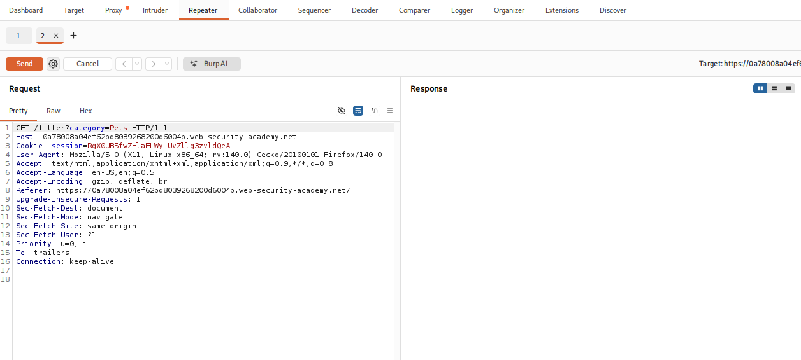
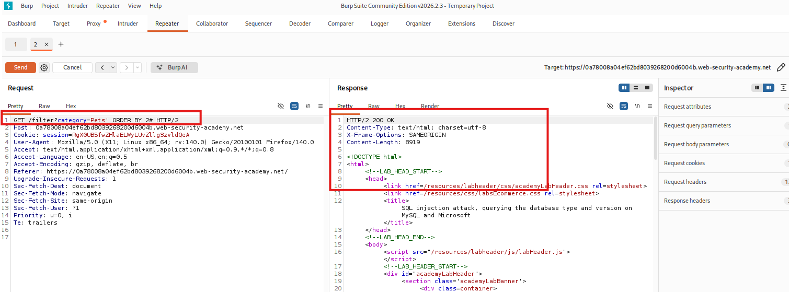
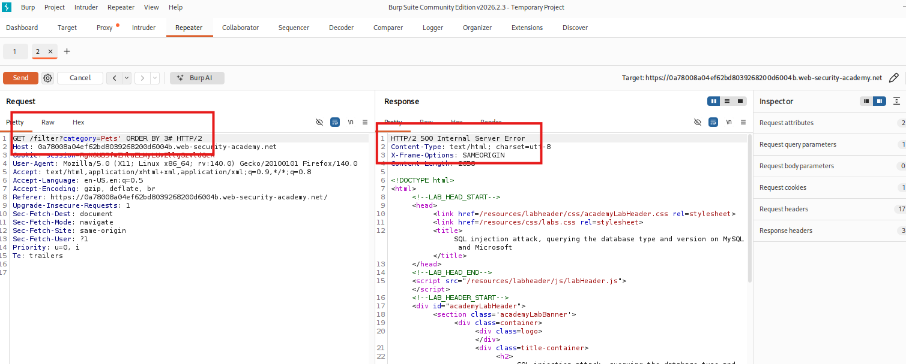
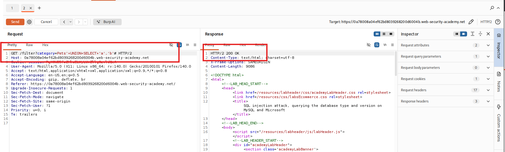
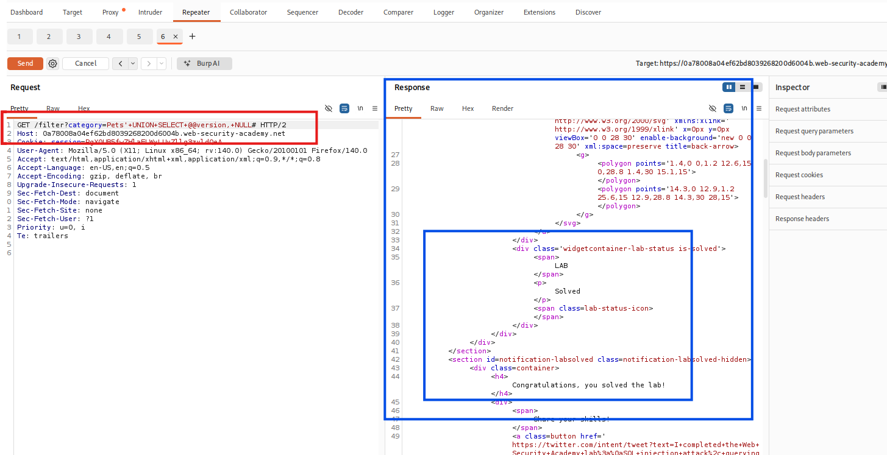
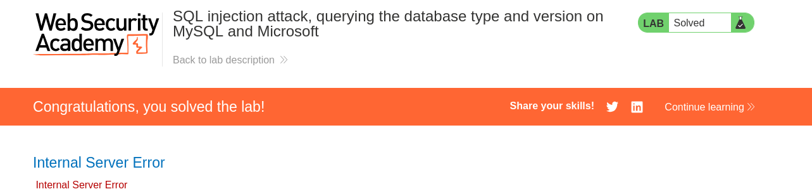

# SQL injection attack, querying the database type and version on MySQL and Microsoft

## I. Descripción de la vulnerabilidad o ataque
El filtro de categoría de la aplicación es vulnerable a inyección SQL. En este escenario, el backend interactúa con un motor de base de datos **MySQL** o **Microsoft SQL Server**. El objetivo es determinar las características del entorno del servidor mediante la inyección de funciones específicas que devuelven la versión del software. A diferencia de Oracle, estos motores permiten omitir la cláusula `FROM` en consultas `UNION` sencillas y utilizan caracteres de comentario distintos (como `#` o `-- ` con un espacio obligatorio al final en MySQL).

## II. Tabla de Códigos de Referencia (NIST, MITRE, CWE)

| Marco de Referencia | Código / Identificador | Descripción |
| :--- | :--- | :--- |
| **CWE** | CWE-89 | Improper Neutralization of Special Elements used in an SQL Command ('SQL Injection') |
| **MITRE ATT&CK** | T1190 | Exploit Public-Facing Application (Initial Access) |
| **NIST SP 800-53** | SI-10 | Information Input Validation |
| **OWASP Top 10** | A03:2021-Injection | Categoría principal de vulnerabilidades de inyección |

## III. Detección y Explotación Paso a Paso

### Paso 1: Interceptación del tráfico y envío al Repeater
1. Abre el navegador integrado de Burp Suite y accede al laboratorio.
2. Haz clic en cualquiera de los filtros de categoría de productos (por ejemplo, *Corporate* o *Gifts*).
3. Dirígete a la pestaña **Proxy > HTTP history** en Burp Suite, localiza la petición `GET /filter?category=...` y presiona `Ctrl + R` (o clic derecho y selecciona **Send to Repeater**).
4. Ve a la pestaña **Repeater** para comenzar a interactuar directamente con el parámetro vulnerable de forma controlada.

> **Petición capturada en Burp Repeater**
> 

---

### Paso 2: Determinación del número de columnas con ORDER BY
Para poder estructurar una inyección basada en `UNION`, el query inyectado debe retornar obligatoriamente el mismo número de campos que la consulta legítima. 

1. En el parámetro `category=`, inyecta secuencialmente índices numéricos cerrando la consulta con un comentario. Como estamos en un entorno web que interactúa con **MySQL/MSSQL**, utilizaremos la almohadilla (`#`).
2. Envía el payload: `' ORDER BY 1%23` (Debería responder con un código HTTP `200 OK`).
3. Modifica e incrementa el payload a: `' ORDER BY 2%23` (Mantiene el código HTTP `200 OK`).
4. Incrementa una vez más a: `' ORDER BY 3%23`. En este punto, la aplicación web fallará devolviendo un error HTTP `500 Internal Server Error`. 

Al fallar en la tercera columna, determinamos con certeza que la consulta original maneja exactamente **2 columnas**.

> **Respuesta exitosa de la aplicación web (2 columnas estables)**
> 

> **Respuesta de error del servidor al exceder el límite de columnas**
> 

---

### Paso 3: Comprobación de compatibilidad de tipos (String)
Los motores de bases de datos **MySQL** y **Microsoft SQL Server** nos permiten omitir la cláusula `FROM` al realizar consultas genéricas o de prueba, lo que simplifica la validación inicial de los tipos de datos.

1. Borra la sentencia anterior en el parámetro de categoría e inyecta valores nulos o cadenas de texto `'a'` para verificar qué columnas renderizan texto de tipo `String` en la respuesta HTML:
   ```sql
   ' UNION SELECT 'a', 'b'#
   ```
2. Al enviarlo a través de Burp Repeater, recuerda que debes codificar los caracteres especiales en URL
   ```bash
   ' UNON+SELECT+'a','b'#
   ```
3. Envía la peticion y confirma que el servidor responde con un http `200 OK`, lo que demuetra que mabas columnas aceptan valores de tipo texto para reflejarlos en la pagina.
> **Respuesta exitosa de la aplicacion web**
> 

### Paso 4: Exfiltracion de la versión de la DB
tanto en **MySQL** como en **Microsoft SQL Server**, la información asociada a la versión del software se almacena en la funcion o variable global del sistema denominada `@@version`.

1. Aprovechando que la consulta original posee 2 columnas de tipo texto, inyectaramos `@@version` en la primera columna y completaremos la segunda columna con un valor generico o `NULL`.
2. El payload diseñado para la D  es:
```SQL
' UNION SELECT @@version, NULL#
```
3. Envía la solicitud. En el panel de la respuesta (Response), identifica el banner exacto del software exfiltrado en el cuerpo del HTML
> **Repuesta exitosa del response en Burp Suite, obteniendo la versiona de la DB**
> 

### Paso 5: Verificación del Laboratorio Resuelto
1. Copia exactamente el payload funcional y codificado que determinaste en tu análisis técnico dentro de Burp Repeater.
2. Pégalo directamente en la barra de direcciones de tu navegador web en la sesión activa del laboratorio, reemplazando el valor del parámetro de filtrado.
3. Al presionar Enter, la página se renderizará con la información inyectada y el banner institucional de PortSwigger se actualizará a color verde confirmando la resolución exitosa del desafío.
> **Evidencia de Laboratorio Resuelto con Éxito**
> 


## IV. Mitigación
1. **Uso de ORM y Sentencias Preparadas (Prepared Statements):** Utilizar tecnologías de abstracción de datos o parametrización nativa en el código fuente de la aplicación (.NET, Java, etc.). Esto separa rigurosamente la lógica del código de los datos del usuario, impidiendo que el motor interprete los caracteres de control (`'`, `--`, `#`) como instrucciones SQL.
2. **Desactivación de Mensajes de Error Detallados:** Configurar el servidor web y el motor de base de datos para que no devuelvan códigos o mensajes de error detallados (`Internal Server Error` descriptivos) al cliente. Esto mitiga la fase de enumeración del atacante al limitar el reconocimiento (reconnaissance).
3. **Firewall de Aplicaciones Web (WAF)**: Desplegar firmas de inspección profunda en el WAF corporativo que bloqueen e identifiquen patrones comunes de ataques basados en funciones y variables del sistema altamente conocidas como `@@version`.

## ⚠️ Aviso de Responsabilidad y Ética (Disclaimer)

> [!CAUTION]
> **ADVERTENCIA DE SEGURIDAD:** El contenido de este repositorio tiene fines **estrictamente educativos y de investigación**. El uso de estas técnicas sin autorización es ilegal.

Como profesional en formación en el área de la ciberseguridad, es mi responsabilidad subrayar los siguientes puntos:

* **Entornos Controlados:** Todas las pruebas de concepto (PoC) documentadas aquí se han realizado en laboratorios autorizados (**PortSwigger Academy**) y entornos locales diseñados específicamente para este fin.
* **Autorización Explícita:** Nunca se debe ejecutar ninguna técnica de inyección o escaneo sobre sistemas, redes o aplicaciones sin la **autorización previa, explícita y por escrito** de los propietarios de dichos activos.
* **Marco Legal:** El uso no autorizado de estas técnicas en sistemas reales constituye un delito informático bajo las leyes internacionales y locales. El acceso no autorizado a sistemas de procesamiento de datos es punible por ley.

---

> [!IMPORTANT]
> *"La seguridad es un proceso de construcción, no de destrucción. Mi objetivo es identificar vulnerabilidades para fortalecer las defensas y proteger la integridad de los datos de los usuarios."*

---
