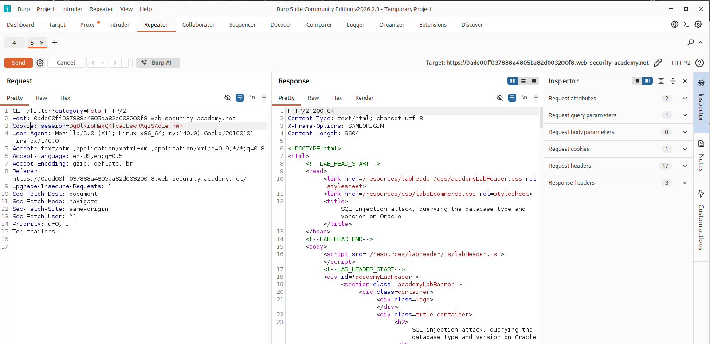
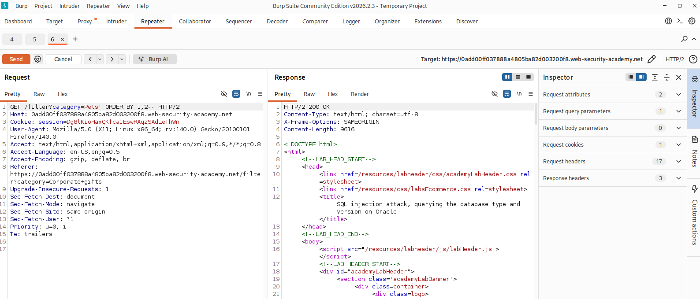
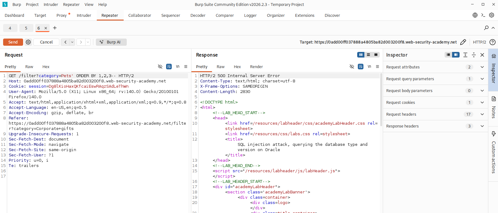

# SQL injection attack, querying the database type and version on Oracle

## I. Descripción de la vulnerabilidad o ataque
Este laboratorio contiene una vulnerabilidad de inyección SQL en el filtro de categoría de productos. Al ser una base de datos **Oracle**, la consulta e interrogación del sistema para determinar la versión del software requiere una sintaxis específica. A diferencia de otros motores, Oracle exige que toda instrucción `SELECT` apunte a una tabla existente; para consultas genéricas o de variables de entorno, se debe invocar la tabla del sistema integrada llamada `DUAL`. El objetivo del atacante es realizar un ataque de tipo UNION para inyectar una consulta que extraiga la versión de la base de datos.

## II. Tabla de Códigos de Referencia (NIST, MITRE, CWE)

| Marco de Referencia | Código / Identificador | Descripción |
| :--- | :--- | :--- |
| **CWE** | CWE-89 | Improper Neutralization of Special Elements used in an SQL Command ('SQL Injection') |
| **MITRE ATT&CK** | T1190 | Exploit Public-Facing Application (Initial Access) |
| **MITRE ATT&CK** | T1505.003 | Server Software Component: Web Shell / Execution |
| **NIST SP 800-53** | SI-10 | Information Input Validation |
| **OWASP Top 10** | A03:2021-Injection | Categoría principal de vulnerabilidades de inyección |

## III. Detección y Explotación Paso a Paso

### Paso 1: Interceptación del tráfico y envío al Repeater
1. Abre el navegador integrado de Burp Suite y accede al laboratorio.
2. Haz clic en cualquiera de los filtros de categoría de productos (por ejemplo, *Pets* o *Gifts*).
3. Ve a la pestaña **Proxy > HTTP history** en Burp Suite, localiza la petición `GET /filter?category=...` y presiona `Ctrl + R` (o clic derecho y **Send to Repeater**).
4. Dirígete a la pestaña **Repeater** para comenzar las pruebas controladas.
> 

---

### Paso 2: Determinación del número de columnas con ORDER BY
Para que un ataque `UNION` funcione, nuestro payload debe devolver exactamente el mismo número de columnas que la consulta original. En Oracle, probamos secuencialmente incrementando el índice:

1. En el parámetro `category=`, añade al final `' ORDER BY 1--` y haz clic en **Send**.
2. Modifica el parámetro a `' ORDER BY 2--` y vuelve a enviar.
3. Continúa incrementando (`' ORDER BY 3--`) hasta que la aplicación web devuelva un error (normalmente un `HTTP 500 Internal Server Error`). Si con el número 3 da error, significa que la consulta original devuelve exactamente **2 columnas**.

> **Respuesta Exitosa**
> 

>**Respuesta de fallo**
>

### Paso 3: Confimación de columnas que aceptan texto (String)
Oracle es estremadamente estricto con los tipos de datos y **exige** que uses la tabla del sistem 
DUAL:
```sql
' UNION SELECT banner, NULL FROM v$version--
```

## Mitigación
1. Consultas Parametrizadas (Prepared Statements): Asegurar que las entradas del usuario nunca se concatenen directamente en la sentencia SQL.

2. Validación de Entradas (White-listing): Implementar un filtrado estricto donde el parámetro category solo acepte valores previamente aprobados en una lista blanca.

3. Principio de Menor Privilegio: Configurar la cuenta de conexión a la base de datos con permisos estrictamente limitados (por ejemplo, restringir el acceso de lectura a tablas del sistema como v$version si no es necesario para el negocio).

## Aviso de Seguridad
[!WARNING]
Aviso de Seguridad: El contenido de este documento tiene fines exclusivamente educativos y de desarrollo profesional en pruebas de penetración autorizadas. La explotación de vulnerabilidades en entornos e infraestructura sin el consentimiento explícito y por escrito del propietario es ilegal y está penada por las leyes de ciberseguridad internacionales y locales. El autor no se hace responsable del mal uso de esta información.
