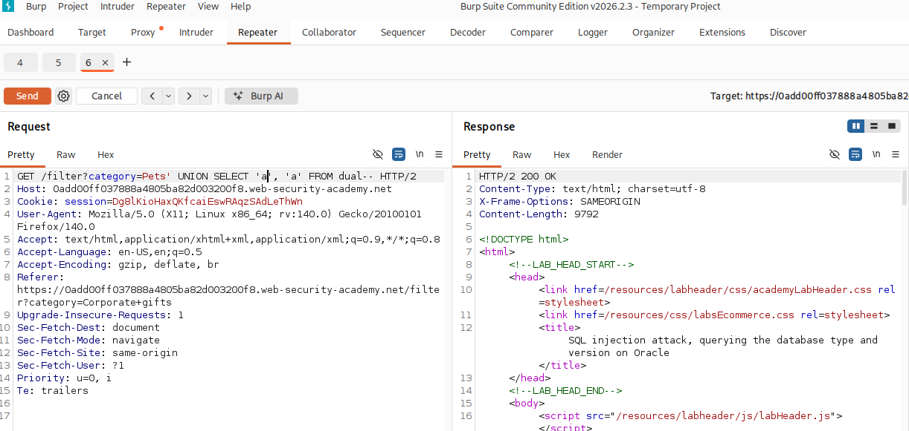
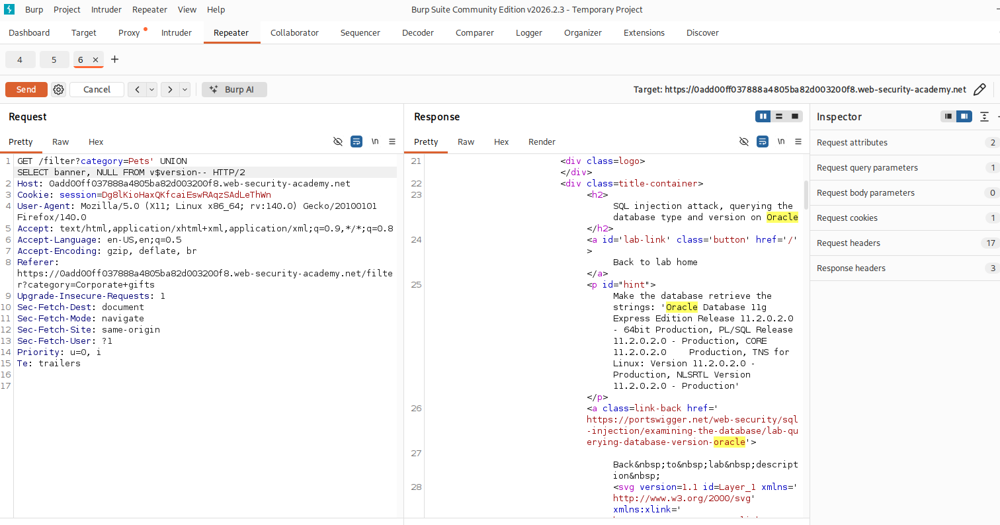
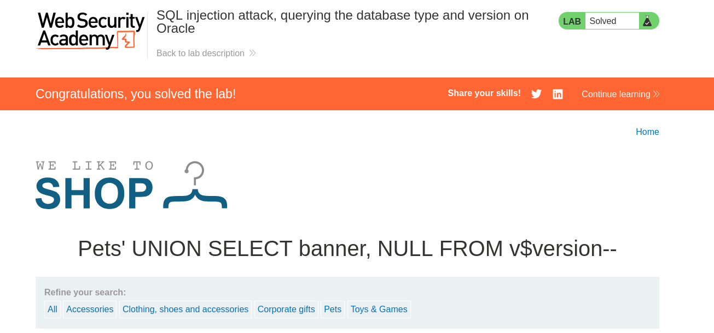

# SQL injection attack, querying the database type and version on Oracle

## I. Descripción de la vulnerabilidad o ataque
Este laboratorio contiene una vulnerabilidad de inyección SQL en el filtro de categoría de productos. Al ser una base de datos **Oracle**, la consulta e interrogación del sistema para determinar la versión del software requiere una sintaxis específica. A diferencia de otros motores, Oracle exige que toda instrucción `SELECT` apunte a una tabla existente; para consultas genéricas o de variables de entorno, se debe invocar la tabla del sistema integrada llamada `DUAL`. El objetivo del atacante es realizar un ataque de tipo UNION para inyectar una consulta que extraiga la versión de la base de datos.

## II. Tabla de Códigos de Referencia (NIST, MITRE, CWE)

| Marco de Referencia | Código / Identificador | Descripción |
| :--- | :--- | :--- |
| **CWE** | CWE-89 | Improper Neutralization of Special Elements used in an SQL Command ('SQL Injection') |
| **MITRE ATT&CK** | T1190 | Exploit Public-Facing Application (Initial Access) |
| **MITRE ATT&CK** | T1505.003 | Server Software Component: Web Shell / Execution |
| **NIST SP 800-53** | SI-10 | Information Input Validation |
| **OWASP Top 10** | A03:2021-Injection | Categoría principal de vulnerabilidades de inyección |

## III. Detección y Explotación Paso a Paso

### Paso 1: Interceptación del tráfico y envío al Repeater
1. Abre el navegador integrado de Burp Suite y accede al laboratorio.
2. Haz clic en cualquiera de los filtros de categoría de productos (por ejemplo, *Pets* o *Gifts*).
3. Ve a la pestaña **Proxy > HTTP history** en Burp Suite, localiza la petición `GET /filter?category=...` y presiona `Ctrl + R` (o clic derecho y **Send to Repeater**).
4. Dirígete a la pestaña **Repeater** para comenzar las pruebas controladas.
> 

---

### Paso 2: Determinación del número de columnas con ORDER BY
Para que un ataque `UNION` funcione, nuestro payload debe devolver exactamente el mismo número de columnas que la consulta original. En Oracle, probamos secuencialmente incrementando el índice:

1. En el parámetro `category=`, añade al final `' ORDER BY 1--` y haz clic en **Send**.
2. Modifica el parámetro a `' ORDER BY 2--` y vuelve a enviar.
3. Continúa incrementando (`' ORDER BY 3--`) hasta que la aplicación web devuelva un error (normalmente un `HTTP 500 Internal Server Error`). Si con el número 3 da error, significa que la consulta original devuelve exactamente **2 columnas**.

> **Respuesta Exitosa**
> 

>**Respuesta de fallo**
>

### Paso 3: Confimación de columnas que aceptan texto (String)
Oracle es estremadamente estricto con los tipos de datos y **exige** que uses la tabla del sistema DUAL si no estas consultando una tabla real del negocio. Vamos a verificar que columnas aceptan caracteres inyectando cadenas de texto 'a':

1. Borra el comando anterior e inyecta el siguiente payload para probar si la primera columna acepta texto:
```sql
' UNION SELECT 'a', NULL FROM dual--
```
2. Envía la petición y comprueba que responda con un HTTP 200 OK.
3. Ahora, prueba la segunda cimuna modificando el payload:
```sql
' UNION SELECT NULL, 'a' FROM dual--
```
4. Confirma que ambas columnas son compatibles cin tipos de datos String si ambas peticiones devuelven un código 200 exitoso.
> Repuesta 200
> 

### Paso 4: Extracción de la versión de la base de datos (Payload Final)
En las bases de datos Oracle, la informacion de la version del software se almacena en una tabla del sistema llamada `v&version` bajo la columna `BANNER`.

1. Aprovechando que sabemos que hay 2 columnas disponibles y que aceptan texto, contruye el payload final apuntando a dicha tabla:
```sql
{ UNION SELECT banner, NULL FROM v$version--
```
3. Introduce el payload en el parametro `category` de la petición en el Repeater y haz clic en Send.
4. En el panel de la respuesta (Response), una la barra de busqueda interna (`ctrl - F`) y escribe Oracle para localizar el texto inyectado en el HTML
> **Respuesta de versionado de Oracle**
> 


### Paso 5: Verificacion del Laboratorio Resuelto
1. Copia el payload que funcionó en el Repeater y pégalo directamente en la barra de direcciones de tu navegador web (reemplazando el valor del filtro de categoría).

2. Presiona Enter para cargar la página en el navegador. El banner superior de PortSwigger debería cambiar a verde indicando "Congratulations, you solved the lab!".



## Mitigación
1. Consultas Parametrizadas (Prepared Statements): Asegurar que las entradas del usuario nunca se concatenen directamente en la sentencia SQL.

2. Validación de Entradas (White-listing): Implementar un filtrado estricto donde el parámetro category solo acepte valores previamente aprobados en una lista blanca.

3. Principio de Menor Privilegio: Configurar la cuenta de conexión a la base de datos con permisos estrictamente limitados (por ejemplo, restringir el acceso de lectura a tablas del sistema como v$version si no es necesario para el negocio).

---

## ⚠️ Aviso de Responsabilidad y Ética (Disclaimer)

> [!CAUTION]
> **ADVERTENCIA DE SEGURIDAD:** El contenido de este repositorio tiene fines **estrictamente educativos y de investigación**. El uso de estas técnicas sin autorización es ilegal.

Como profesional en formación en el área de la ciberseguridad, es mi responsabilidad subrayar los siguientes puntos:

* **Entornos Controlados:** Todas las pruebas de concepto (PoC) documentadas aquí se han realizado en laboratorios autorizados (**PortSwigger Academy**) y entornos locales diseñados específicamente para este fin.
* **Autorización Explícita:** Nunca se debe ejecutar ninguna técnica de inyección o escaneo sobre sistemas, redes o aplicaciones sin la **autorización previa, explícita y por escrito** de los propietarios de dichos activos.
* **Marco Legal:** El uso no autorizado de estas técnicas en sistemas reales constituye un delito informático bajo las leyes internacionales y locales. El acceso no autorizado a sistemas de procesamiento de datos es punible por ley.

---

> [!IMPORTANT]
> *"La seguridad es un proceso de construcción, no de destrucción. Mi objetivo es identificar vulnerabilidades para fortalecer las defensas y proteger la integridad de los datos de los usuarios."*

---
