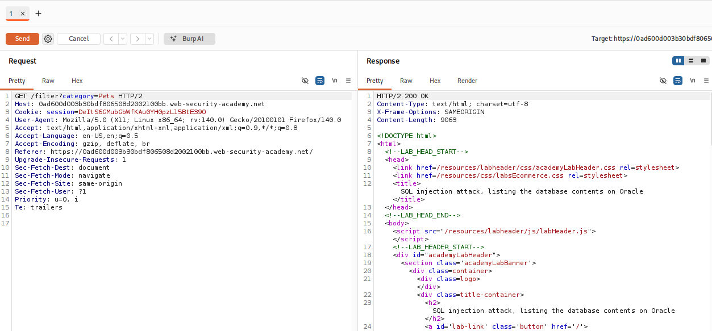
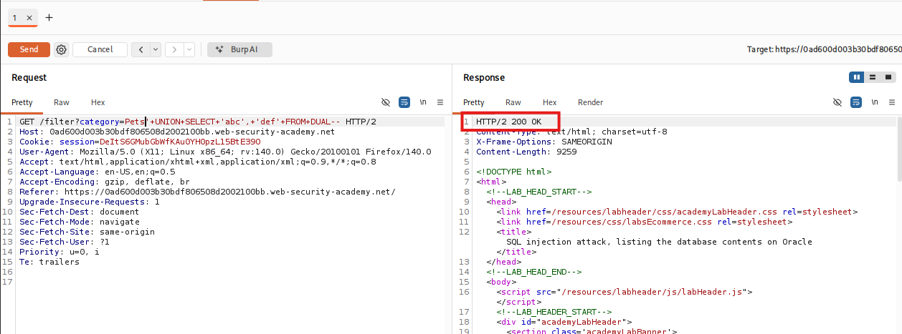
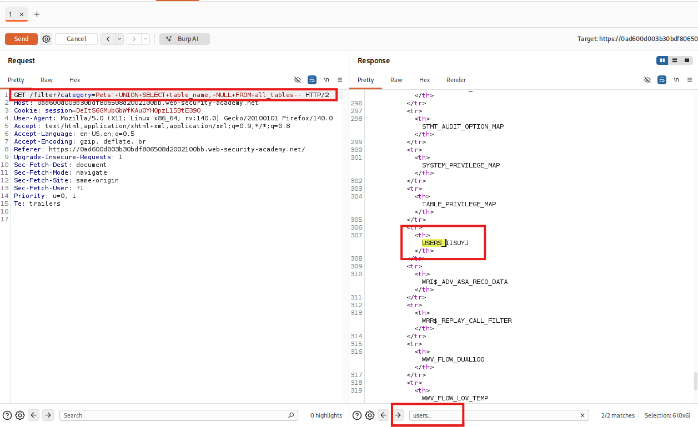
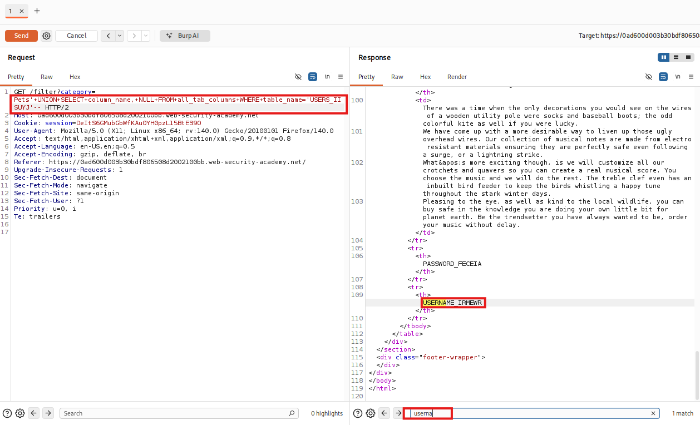
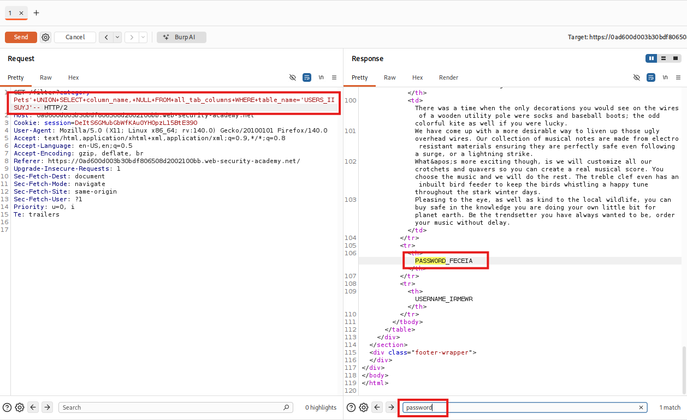
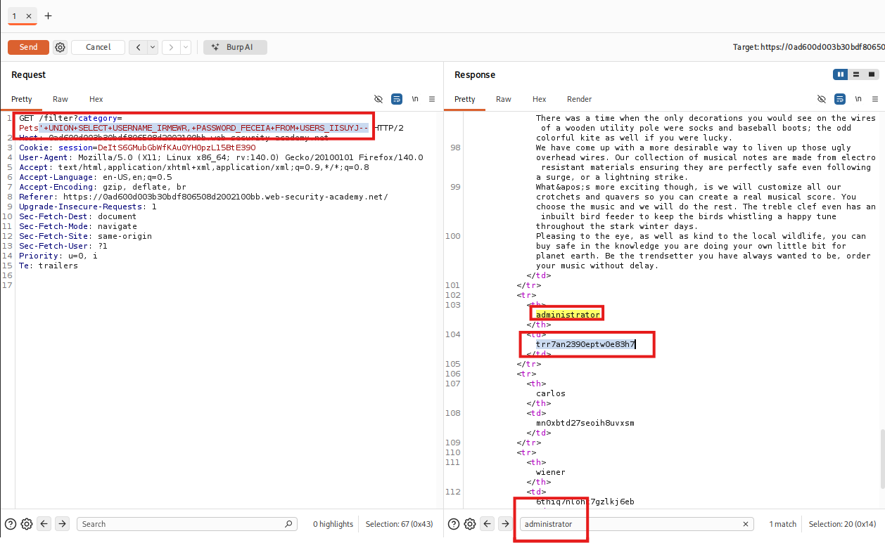
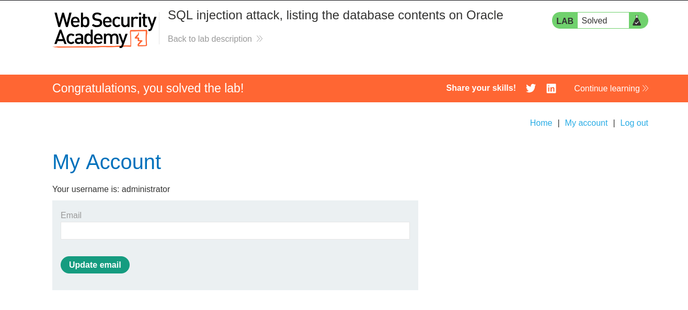

# SQL injection attack, listing the database contents on non-Oracle databases

## I. Descripción de la vulnerabilidad o ataque
Este laboratorio presenta un escenario avanzado de explotación de inyección SQL de tipo UNION. Una vez que se detecta que el backend utiliza una base de datos estándar (no Oracle, por ejemplo PostgreSQL), el objetivo del atacante cambia de la simple identificación del entorno hacia la **exfiltración de datos**. El proceso requiere interrogar las tablas del esquema de información (`information_schema`) para mapear la estructura interna del almacenamiento: nombres de tablas, columnas críticas (como usuarios y contraseñas) y, finalmente, extraer las credenciales del usuario administrador para comprometer el control de acceso.

## II. Tabla de Códigos de Referencia (NIST, MITRE, CWE)

| Marco de Referencia | Código / Identificador | Descripción |
| :--- | :--- | :--- |
| **CWE** | CWE-89 | Improper Neutralization of Special Elements used in an SQL Command ('SQL Injection') |
| **CWE** | CWE-306 | Missing Authentication for Critical Function |
| **MITRE ATT&CK** | T1190 | Exploit Public-Facing Application (Initial Access) |
| **MITRE ATT&CK** | T1078 | Valid Accounts (Lateral Movement / Persistence) |
| **NIST SP 800-53** | IA-2 | Identification and Authentication (Organizational Users) |
| **OWASP Top 10** | A03:2021-Injection | Categoría principal de vulnerabilidades de inyección |

## III. Detección y Explotación Paso a Paso

### Paso 1: Interceptación del tráfico y determinación del entorno
1. Abre el navegador integrado de Burp Suite, activa el proxy e intercepta una petición al filtrar cualquier categoría en la aplicación corporativa (ej. `GET /filter?category=Pets`).
2. Envía la petición capturada al **Repeater** (`Ctrl + R`).
3. Realiza una validación inicial rápida inyectando un comentario estándar (`'--`) o verificando el número de columnas con `ORDER BY`. Al confirmar que el sitio responde correctamente sin la necesidad de invocar tablas específicas del sistema (como `DUAL` en Oracle), validamos que nos enfrentamos a una base de datos estándar no-Oracle (como **PostgreSQL**).

> **Petición inicial interceptada en Burp Repeater**
> 

### Paso 2: Determinación de columnas y tipos de datos compatibles
Para realizar el ataque `UNION` que nos permita extraer el esquema, primero debemos determinar la estructura del query original.

1. Inyecta sentencias `ORDER BY` consecutivas en el parámetro `category` para forzar un error en el servidor:
   ```text
   ' ORDER BY 1--
   ' ORDER BY 2--
   ' ORDER BY 3--
   ```
*Si el servidor devuelve un error HTTP 500 en la tercera instrucción, se concluye que la consulta maneja exactamente 2 columnas.*

2. Comprobamos que ambas columna soportan tipos de datos de texto (String) enviando valores de prueba como el entorno es Oracle inyectamos una consulta estructurada que apunte a la tabla del sistema obligatoria:
   ```plaintext
   '+UNION+SELECT+'abc',+'def'+FROM+DUAL--
   ```
3. Verificamos el codigo de respuesta http `200 OK`, asegurando que ambas columnas son válidas para inyectar payloads de exfiltración de string

> **Respuesta del servidor 200 OK**
> 

### Paso 3: Mapeo del esquema e identificación de tablas críticas
En las bases de datos no-Oracle, existe una estructura lógica global llamada information_schema. Nuestro primer objetivo es listar los nombres de todas las tablas alojadas en la base de datos para buscar aquellas relacionadas con credenciales de usuarios.
1. Construimos un payload inyectando la columna `table_name` desde la vista del sistema `information_schema.tables`:
```SQL
'+UNION+SELECT+table_name,+NULL+FROM+all_tables--
```
2. Enviamos la petición en el Repeater y analizamos la respuesta HTML. Utilzamos el buscador interno para filtrar términos sospechosos o criticos como `user`, `admin` o `credential`.
3. Identificamos el nombre exacto de la tabla de usuarios generada por el laboratorio (Por ejemplo:`USERS_IISUYJ` )

> **Identificacion de la tabla buscada en la respuesta**
> 

### Paso 4: Enumeración de las columnas de la tabla objetivo
Una vez que conocemos el nombre exacto de la tabla crítica (asumamos para este ejemplo que se llama `USERS_IISUYJ`), necesitamos averiguar cómo se llaman las columnas de contraseñas y nombres de usuario para poder llamarlas de forma precisa.
```SQL
'+UNION+SELECT+column_name,+NULL+FROM+all_tab_columns+WHERE+table_name='USERS_IISUYJ'--
```
2. Enviamos la petición en el Repeater y analizamos la respuesta HTML. Utilzamos el buscador interno para filtrar términos sospechosos o criticos como `username` y `password`.

**Identificacion del nombre de las columnas necesarias en el Response**
> **Columna: Username**
> 
* **Columna username: `USERNAME_IRMEWR`**

> **Columna: Password**
> 
* **Columna password: `PASSWORD_FECEIA`**

### Paso 5: Exfiltración de credenciales (Payload Final)
Conociendo con exactitud el nombre de la tabla objetivo (`USERS_IISUYJ`) y sus columnas clave (`USERNAME_IRMEWR` y `PASSWORD_FECEIA`), procedemos a extraer el contenido completo de la base de datos.
1. Reeplazzamos las columna del `UNION SELECT` por los nombre de columna reales de los usuarios y contraseñas descubiertos:
  ```SQL
'+UNION+SELECT+USERNAME_IRMEWR,+PASSWORD_FECEIA+FROM+USERS_IISUYJ--
```
2. Enviamos la petición HTTP en el Repeater. El cuerpo de la respuesta HTML reflejará el listado de todos los usuarios registrados con sus respectivos hashes o contraseñas en testo plano.
3. Itentificamos las columnas precisas para obtener la credenciales que necesitamos del administrador (user: `administrator` y pass: `trr7an2390eptw0e83h7`)

> **Credenciales del Administrador encontradas**
> 

### Paso 6: Inicio de sesión y Verificación del Administrador
1 Regresa al navegador web integrado y haz clic en la sección My account.
2 Introduce las credenciales exfiltradas de la cuenta comprometida
  * Username: `administrator`
  * Password: `trr7an2390eptw0e83h7`
3. Presiona **Log in**. Al iniciar sesión con los privilegios máximos del backend, el entorno de PortSwiggert validará la resolucion exitosa del desafío.

> **Ingreso de Credenciales**
> 

## IV. Mitigación
1. **Implementación de Consultas Parametrizadas (Prepared Statements):** Configurar el código fuente de la aplicación utilizando marcadores de posición para las variables (ej. `SELECT * FROM products WHERE category = :category` en lenguajes como C#/.NET o Java). Esto asegura que el motor de Oracle trate la entrada estrictamente como un literal de datos y no como código ejecutable.

2. **Restricción de Privilegios sobre Vistas de Diccionario de Datos:** Aplicar el principio de menor privilegio a la cuenta de base de datos que utiliza la aplicación web. Se debe restringir o revocar el acceso de lectura a vistas globales del diccionario de datos como `all_tables` y `all_tab_columns` si no son requeridas para la funcionalidad operativa del negocio.

3. **Validación de Entradas mediante Listas Blancas (Whitelist):** Dado que las categorías de productos suelen ser un conjunto finito de datos bien definido, el backend debe validar el parámetro `category` contra una lista blanca estricta antes de realizar cualquier interacción o consulta en la base de datos.


---

## ⚠️ Aviso de Responsabilidad y Ética (Disclaimer)

> [!CAUTION]
> **ADVERTENCIA DE SEGURIDAD:** El contenido de este repositorio tiene fines **estrictamente educativos y de investigación**. El uso de estas técnicas sin autorización es ilegal.

Como profesional en formación en el área de la ciberseguridad, es mi responsabilidad subrayar los siguientes puntos:

* **Entornos Controlados:** Todas las pruebas de concepto (PoC) documentadas aquí se han realizado en laboratorios autorizados (**PortSwigger Academy**) y entornos locales diseñados específicamente para este fin.
* **Autorización Explícita:** Nunca se debe ejecutar ninguna técnica de inyección o escaneo sobre sistemas, redes o aplicaciones sin la **autorización previa, explícita y por escrito** de los propietarios de dichos activos.
* **Marco Legal:** El uso no autorizado de estas técnicas en sistemas reales constituye un delito informático bajo las leyes internacionales y locales. El acceso no autorizado a sistemas de procesamiento de datos es punible por ley.

---

> [!IMPORTANT]
> *"La seguridad es un proceso de construcción, no de destrucción. Mi objetivo es identificar vulnerabilidades para fortalecer las defensas y proteger la integridad de los datos de los usuarios."*

---

